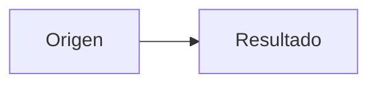

# Formato de contenido editorial

`presentations/<slug>/_working/structure/slide-content.md` es la fuente editorial unica de una presentacion. El agente lo crea despues de resolver el material inicial, la plantilla y los datos necesarios. El usuario puede editarlo directamente antes de la generacion.

El original de trabajo permanece en `_working/structure/`. El ZIP incluye todos los archivos de esa carpeta bajo `structure/` y copia el archivo editorial como `slide-content.md` en la raíz para conservar la definición y los materiales que determinan la estructura y el contenido. `sources/` permanece fuera del ZIP. El archivo editorial no sustituye `deck.json`, los archivos HTML, las notas ni las fuentes Mermaid: el agente deriva esos artefactos desde su contenido validado.

## Reglas

- Usar un encabezado `## Diapositiva NNN: titulo` por diapositiva, en el orden final
- Declarar en cada diapositiva una estructura permitida por el `structureIndex` de la plantilla seleccionada
- Escribir todos los textos visibles, incluidos titulos, subtitulos, contexto, etiquetas, leyendas, pies y llamados a la accion
- Declarar cada recurso con su ruta final local bajo `assets/`; si aun no existe, indicar `Estado: pendiente`, ruta final, texto alternativo y pie visible
- Declarar una ruta final bajo `diagrams/` y la fuente Mermaid completa para todo diagrama relacional
- Declarar datos de tablas y graficas en el archivo, con unidades, periodo, fuente, conclusion y alternativa textual cuando corresponda
- Declarar por concepto el rol, nombre, peso y razon de cada icono; una omision debe indicar su motivo permitido
- Usar `No aplica` solo para un campo condicional que no corresponde a la estructura
- No dejar marcadores como `Por definir`, `Pendiente` o valores vacios antes de generar
- Mantener los nombres de estructura y rutas en ASCII; el contenido visible usa el idioma de la presentacion

## Plantilla base

~~~~md
# Contenido editorial

## Presentacion

- Titulo visible: <titulo>
- Subtitulo: <texto o No aplica>
- Idioma: <codigo>
- Plantilla: <nombre visible> (`<id>`)
- Notas: <si o no>

## Identidad

- Integrantes: <nombres o presentacion individual>
- Materia: <texto o No aplica>
- Institucion: <texto o No aplica>
- Facultad o carrera: <texto o No aplica>
- Docente o responsable: <texto o No aplica>
- Fecha: <texto o No aplica>

---

## Diapositiva 001: <titulo>

- Estructura: <nombre visible> (`<id de structureIndex>`)
- Titulo: <texto visible>
- Subtitulo: <texto visible o No aplica>
- Contexto: <texto visible o No aplica>
- Notas: <contenido de notes/001.md o No aplica>

### Contenido

<texto, listas, citas o elementos visibles de la estructura>

### Iconos

- Concepto: <concepto concreto>
  - Biblioteca: Phosphor
  - Rol: <rol ASCII>
  - Nombre Phosphor: <nombre ASCII>
  - Peso: regular | bold | duotone
  - Razon semantica: <texto>

### Recursos

- Tipo: imagen | logo | captura | ilustracion
  - Estado: disponible | pendiente
  - Ruta final: assets/<tipo>/<archivo>
  - Fuente de trabajo: _working/sources/<archivo o No aplica>
  - Texto alternativo: <texto>
  - Pie visible: <texto>

---
~~~~

## Bloques condicionales

Agregar solo los bloques que exige la estructura elegida.

### Unidades tematicas

Usar en pilares, comparaciones, narrativas y procesos. Cada unidad declara tema, descripcion e icono. Para una omision valida, reemplazar el bloque de icono por `- Iconos: ninguno` y `- Motivo de omision: user-request | no-semantic-match`.

~~~~md
### Unidad 1

- Tema: <texto>
- Descripcion: <texto>
- Icono:
  - Concepto: <concepto>
  - Biblioteca: Phosphor
  - Rol: <rol ASCII>
  - Nombre Phosphor: <nombre ASCII>
  - Peso: regular
  - Razon semantica: <texto>
~~~~

Para una biblioteca alternativa o un archivo del usuario, sustituir `Biblioteca: Phosphor` y `Nombre Phosphor` por la biblioteca o `usuario`, y declarar el nombre o archivo exacto, su ruta final local y procedencia. Esa seleccion requiere la decision explicita que exige la skill.

### Nexo narrativo

Usar solo en `narrative-elements` cuando una frase breve explique la relación entre los elementos. Se coloca sobre las columnas, no dentro de la explicación narrativa de la izquierda.

```md
### Nexo narrativo

- Texto: <hasta dos lineas, en cursiva y peso normal>
```

### Tabla

```md
### Tabla

- Titulo: <texto>
- Fuente visible: <texto>

| Encabezado 1 | Encabezado 2 | Encabezado 3 |
|---|---|---|
| Dato | Dato | Dato |
```

### Grafica

```md
### Grafica

- Tipo: dona | barras | lineas
- Titulo: <texto>
- Unidad: <texto>
- Periodo: <texto>
- Fuente visible: <texto>
- Conclusion visible: <texto>
- Alternativa textual: <texto>

| Etiqueta | Valor |
|---|---:|
| Categoria A | 48 |
| Categoria B | 32 |
| Categoria C | 20 |
```

### Diagrama relacional

~~~~md
### Diagrama Mermaid

- Tipo: architecture | workflow | sequence | data-flow | lifecycle | hierarchy | relationship-map
- Direccion de lectura: left-to-right | top-to-bottom
- Ruta final: diagrams/003/main.mmd
- Pie visible: <texto>


~~~~

### Codigo

~~~~md
### Codigo

- Lenguaje: <texto>
- Rango visible: 1-4
- Lineas destacadas: 2-3
- Nota visible: <texto>

```js
const value = input.trim();
if (value) {
    submit(value);
}
```
~~~~
